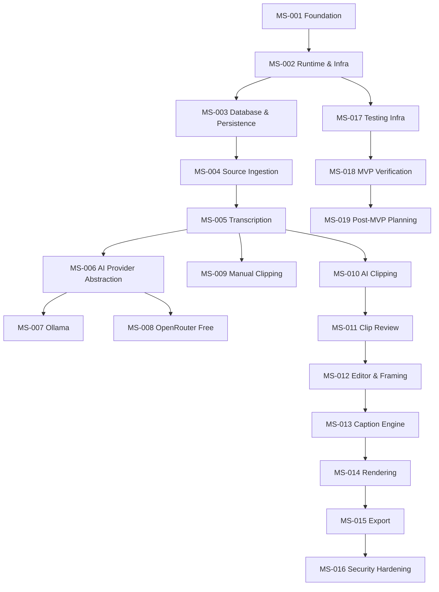

# ClipForge AI — Milestone Roadmap

## 1. Executive Summary
ClipForge AI is an AI‑powered platform that transforms long‑form video content into short, caption‑ready clips. The foundation (MS‑001) is complete. This roadmap defines a clear, dependency‑aware sequence of implementation milestones (MS‑002 → MS‑019) that deliver a functional MVP while respecting security, testing, and the Free‑First AI architecture.

## 2. Current Foundation Status
- **MS‑001 – Foundation & Architecture**: Completed & locked.
- All governance documents, tech stack, and architecture are in place.

## 3. Roadmap Principles
- **Cross‑cutting security**: security considerations are embedded in every milestone; final hardening occurs in MS‑016.
- **Cross‑cutting testing**: test scaffolding starts in MS‑002; each milestone adds its own tests. Comprehensive regression & performance testing concludes in MS‑017.
- **Free‑First AI**: AI provider abstraction (MS‑006) enforces FREE‑ONLY and FREE‑FIRST policies; paid providers are optional and never mandatory.
- **Incremental MVP**: Milestones 002‑018 build the end‑to‑end workflow; MS‑019 is a planning placeholder for future extensions.

## 4. Milestone Dependency Graph

## 5. Detailed Milestones
(See **MILESTONE_REGISTRY.md** for full table.)

### MS‑002 – Application Runtime & Infrastructure
- Set up Next.js frontend and FastAPI backend containers.
- Docker compose, health endpoints, base navigation shell, logging, error handling.
- Establish testing framework (Jest, Playwright, Pytest) as cross‑cutting foundation.

### MS‑003 – Database & Project Persistence
- PostgreSQL async connection, SQLAlchemy models, Alembic migrations.
- Project, source, user ownership schema; auto‑save & resume architecture.

### MS‑004 – Source Ingestion & Validation
- Local upload UI, YouTube URL validation, FFmpeg probing, metadata extraction, StorageDriver abstraction, background ingestion jobs.

### MS‑005 – Transcription Service
- Integrate faster‑whisper (multi‑model strategy), multilingual support, word‑level timestamps, optional OpenAI Whisper fallback under FREE‑FIRST policy.

### MS‑006 – AI Provider Abstraction
- Central AI Router, provider/interface contracts, request/response normalization, Pydantic validation, FREE‑ONLY & FREE‑FIRST policies, telemetry.

### MS‑007 – Ollama Local AI
- Adapter, health checks, model discovery, JSON response handling, graceful fallback.

### MS‑008 – OpenRouter Free Model Routing
- Dynamic free‑model discovery, capability matching, pricing validation, retry/fallback, telemetry.

### MS‑009 – Manual Clipping Engine
- Silence‑aware target clipping (30/60/90 s) for both local and YouTube sources, intelligent boundary selection, extensive test matrix.

### MS‑010 – AI Clip Discovery & Vitality Scoring
- Prompt design, multi‑dimensional scoring (hook, curiosity, emotional, value, standalone, payoff), explainable VitalityScore, duplicate avoidance.

### MS‑011 – Clip Review & Selection UI
- Functional preview of AI candidates, vitality display, justification, actions (Approve / Regenerate / Cancel), persistent selection state.

### MS‑012 – Lightweight Editor & Framing Engine
- Video preview, clip list, timing adjustments, undo/redo, framing modes (Face‑Track, Split‑Screen, Split + Gameplay, Split + Human Reaction, Original).

### MS‑013 – Caption Engine
- 60+ style presets, RTL support, live preview, per‑clip independent configuration, word‑highlight, visual emphasis.

### MS‑014 – Rendering Pipeline
- Asynchronous FFmpeg rendering via Taskiq + Redis, state machine, output validation, temporary artifact cleanup.

### MS‑015 – Export & Gallery
- Rendered clip gallery, download endpoints, metadata persistence, retry handling, UI integration.

### MS‑016 – Security Hardening & Audit
- Full auth/authorization, tenant isolation, rate limiting, CORS, security headers, secret management, file‑access safeguards, audit reporting.

### MS‑017 – Testing Infrastructure & Cross‑Cutting Tests
- Unit, API, integration, UI, E2E, media, AI, security, regression, performance suites; testing scaffolding extended throughout.

### MS‑018 – End‑to‑End MVP Verification & Release
- Real‑world workflow verification (dashboard → export) with functional, UI, backend, DB, AI, media, security, regression, performance checks; generate verification report.

### MS‑019 – Post‑MVP Planning (Future Extensions)
- Placeholder for advanced timeline, overlays, social publishing, paid‑provider fallback, etc.; planning only.

## 6. MVP Boundary
Milestones 002 → 018 constitute the MVP. All core workflow steps are exercised with real media and no mock data.

## 7. Post‑MVP Boundary
Milestone 019 captures future extensions and is kept as a planning placeholder.

## 8. AI Architecture Roadmap
- MS‑006 defines the router.
- MS‑007 implements Ollama.
- MS‑008 implements OpenRouter free‑model routing.
- Paid‑provider fallback is optional and will be introduced only via a future change request.

## 9. Media Architecture Roadmap
- Ingestion and FFmpeg probing (MS‑004).
- Rendering pipeline (MS‑014) with Taskiq + Redis.
- Validation of rendered assets.

## 10. Persistence Roadmap
- Database foundation (MS‑003) and auto‑save mechanisms integrated into subsequent milestones.

## 11. Security Roadmap
- Security embedded cross‑cutting; comprehensive hardening in MS‑016.

## 12. Testing Roadmap
- Testing foundation in MS‑002; per‑milestone tests; regression & performance in MS‑017; final MVP verification in MS‑018.

## 13. Risk Analysis
| Risk Area | Mitigation |
| :--- | :--- |
| YouTube ingestion failures | Background job with retry & clear user alerts (MS‑004). |
| Long video transcription | Scalable faster‑whisper model selection, streaming processing (MS‑005). |
| AI provider unavailability | FREE‑ONLY policy, fallback to other free models, explicit user notification (MS‑006‑008). |
| Rendering large clips | Asynchronous queue, progress telemetry, resource limits (MS‑014). |
| Security breaches | Cross‑cutting security checks, final audit (MS‑016). |
| Test coverage gaps | Early testing scaffold, automated CI pipeline (MS‑002‑017). |

## 14. Feature‑to‑Milestone Mapping
(See **FEATURE_REGISTRY.md** for full table.)

## 15. Dependencies
- Runtime & Infra (MS‑002) is prerequisite for all later work.
- Database (MS‑003) needed before source ingestion and persistence.
- AI abstraction (MS‑006) must exist before any AI‑driven feature.
- Security (MS‑016) and testing (MS‑017) are cross‑cutting and run alongside functional work.

## 16. Acceptance Strategy
Each milestone will produce:
- `milestone‑XXX‑plan.md`
- Feature agent spec (`FEATURE_NAME.agent.md`)
- Implementation code & tests
- Verification report (`milestone‑XXX‑verification-report.md`).
User approval is required before branch creation and implementation.

## 17. Change Control
Any deviation from this roadmap must be captured in a `change‑request‑X.md` document, reviewed, and approved before proceeding.

## 18. Roadmap Self‑Audit
- [x] PRD v0.1.1 unchanged
- [x] Foundation MS‑001 locked
- [x] No fixed milestone‑count rule
- [x] All milestones 002‑019 listed as PLANNED
- [x] Cross‑cutting security & testing documented
- [x] All PRD features mapped in FEATURE_REGISTRY.md
- [x] No product code written
- [x] No implementation branches created

*Prepared by Antigravity – your AI‑augmented software architect.*
